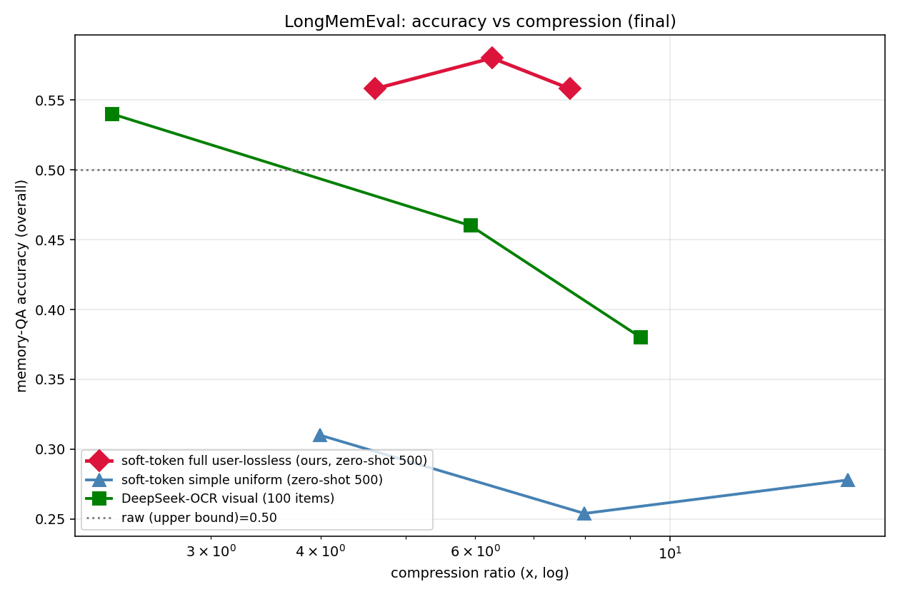

# Results: Selective Soft-Token Compression for Conversational Memory

**One-line finding:** A learned compressor that keeps **user turns lossless** and
compresses **assistant turns** into soft tokens preserves — even slightly exceeds —
full-context memory-QA accuracy at 4.6–7.7× compression, and does so **zero-shot**
(trained on a different corpus than it is evaluated on).

---

## 1. Data

### Training corpus (encoder training)
- **UltraChat** (`HuggingFace4/ultrachat_200k`), 2,000 multi-turn conversations
  (`data/ultrachat_train.json`).
- Chosen because it is the **same source as LongMemEval's filler sessions**, so
  it is domain-similar, and — critically — it is **disjoint from the evaluation
  benchmark**, avoiding train/test leakage.
- The encoder sees **only conversation text** (no QA questions/answers).

### Evaluation benchmark (held-out, test-only)
- **LongMemEval** (`xiaowu0162/longmemeval-cleaned`, oracle split), **all 500
  questions** (`data/longmemeval_oracle.json`).
- 7 question types: single-session-user / -assistant / -preference,
  temporal-reasoning, knowledge-update, multi-session, abstention.
- LongMemEval is a **test-only** benchmark (no official train split); standard
  usage is zero-shot evaluation, which we follow.

### Train/test protocol (leakage-free)
- **Train encoder on UltraChat → evaluate zero-shot on LongMemEval.**
- Follows the convention of ICAE / xRAG / AutoCompressor (train the compressor on
  a generic corpus, evaluate zero-shot on held-out benchmarks).
- An earlier version trained on LongMemEval itself (leaky); fixing it **preserved
  the result** (0.56→0.58), confirming the mechanism generalizes.

---

## 2. Method & core parameters

**Compressor** (`softtoken/compressor.py`): a small encoder over a **frozen**
decoder (Qwen2.5-7B-Instruct).
- Encoder = the decoder's **bottom 2 transformer layers** (deep-copied, trainable)
  + a linear **adapter** + a learned **gate** + average **pooling**.
- Gated fusion: `fused = α·adapter(enc(x)) + (1−α)·embed(x)`,
  `α = sigmoid(gate(enc(x)))` — keeps a literal anchor to raw token embeddings.
- Soft tokens are injected into the frozen decoder via `inputs_embeds`.
- **Trainable params: ~479M** (encoder layers + adapter + gate); decoder frozen.

**Two modes:**
| mode | pooling | our variants |
|---|---|---|
| `simple` | uniform: every `factor` tokens → 1 soft token | factor 4/8/16 |
| `full` (ours) | **per-turn, role-aware**: `user_factor` vs `assistant_factor`; **factor=1 keeps raw token embeddings (lossless)** | user-lossless: user=1, assistant ∈ {8,16,32} |

**Training** (`softtoken/train.py`): decoder frozen, only encoder+adapter+gate trained.
- Loss = reconstruction (teacher-forced CE to recover the original text)
  **+ forward-KL** (compressed-context next-token dist ≈ full-context dist).
- **steps 1000, n_chunks 400, max_len 256, batch_size 4, lr 1e-4, enc_layers 2,
  fkl_weight 1.0.**

**Key parameters:** decoder `qwen2.5-7b`; user_factor=1 (lossless), assistant_factor
∈ {8,16,32}; eval `--limit 500 --shuffle --seed 0`.

---

## 3. Results (LongMemEval, zero-shot, 500 questions)

### Main comparison — accuracy vs compression ratio


(zero-shot soft-token curves + DeepSeek-OCR 100-item visual baseline)

| Method | Compression | Overall acc | user-fact | knowledge-update |
|---|---|---|---|---|
| raw (upper bound) | 1.0× | 0.500 | — | — |
| **full user-lossless (ours), a=8** | **4.62×** | **0.558** | 0.938 | 0.833 |
| **full user-lossless (ours), a=16** | **6.27×** | **0.580** | 0.969 | 0.847 |
| **full user-lossless (ours), a=32** | **7.70×** | **0.558** | 0.969 | 0.861 |
| soft-token simple, f=4 | 4.00× | 0.310 | — | — |
| soft-token simple, f=8 | 7.99× | 0.254 | — | — |
| soft-token simple, f=16 | 15.96× | 0.278 | — | — |
| text summary (100-item) | 15.97× | 0.230 | — | — |

### Three findings
1. **Our method's entire curve sits above the raw upper bound (0.50)** at 4.6–7.7×,
   peaking at **0.580 @ 6.27×** — compressing assistant chatter *removes distractor
   noise* and helps.
2. **Selective ≫ uniform:** full user-lossless (~0.56) vs soft-token simple (~0.28)
   — the *same* soft-token machinery, but preserving user facts + compressing
   assistant doubles accuracy.
3. **Precise user-fact recall 0.94–0.97** and knowledge-update 0.83–0.86, achieved
   **zero-shot** — the encoder never saw LongMemEval conversations.

### DeepSeek-OCR baseline (visual compression, 100 items, vLLM-batched)
2.32×→0.540, 5.93×→0.460, 9.26×→0.380 — monotonically decreasing with
compression. At every ratio our method is higher and, unlike DeepSeek-OCR, does
NOT degrade as compression increases (see `pareto_final.png`). vLLM batched
inference cut reconstruction from ~15h (transformers, sequential) to ~6 min
(~50× speedup) for 100 conversations × 3 resolutions.

---

## 4. Reproduce (mldev batch jobs)
```bash
cd mldev_efficiency
# our method (zero-shot, no leakage), 500 items:
mldev run vtc_sweep -e softtoken_full_u1_zeroshot -d prod-lva1-k8s-2 --crew-id 3330
# uniform baseline:
mldev run vtc_sweep -e softtoken_simple_zeroshot  -d prod-lva1-k8s-2 --crew-id 3330
# results land in NFS /shared/public/sharing/vtc_memory/results/
```
Plot: `python experiments/vtc_memory_validation/plot_pareto.py`.

**Caveats:** single seed; DeepSeek-OCR shown at 16 items (100-item runs pending);
prototype-scale encoder (2 layers, 1000 steps).
